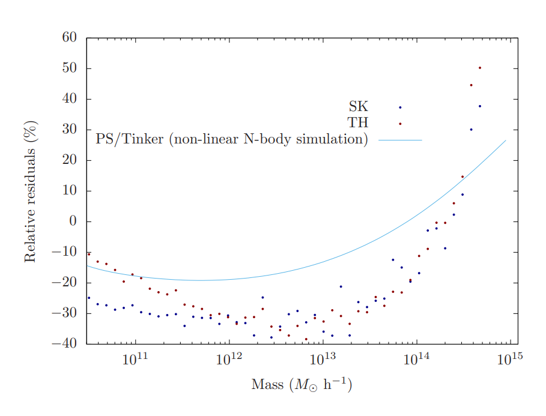
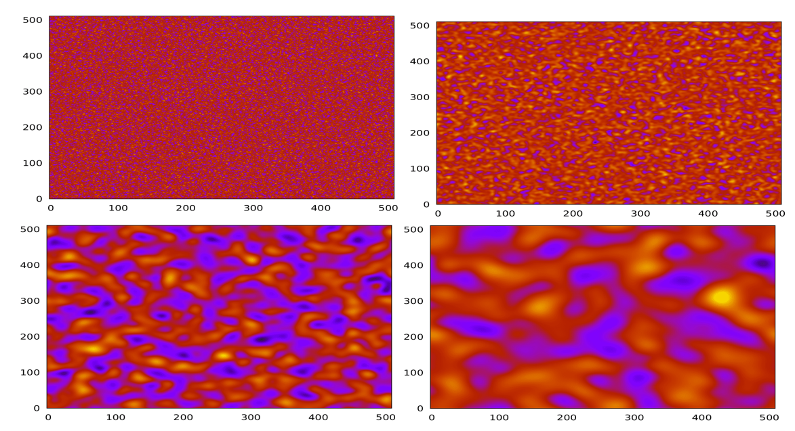
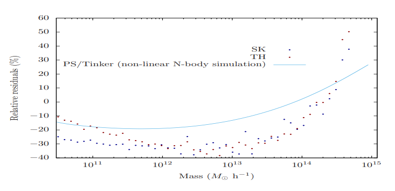

# Cosmological Data Analysis

Comparison of numerical outputs under varying preprocessing configurations.

Goal: identify stability vs deviation across processing choices.

10,000 simulated datasets  
512³ grid resolution  
Fourier-based generation  
50 smoothing steps per run  

---

## Key results

One configuration produces stable alignment with reference outputs.

All other configurations show consistent deviation patterns.

Differences are not random.

---

## Output comparison

Same datasets processed with different configurations.

Output changes depending on preprocessing choice.

Deviations remain stable across full range.

---

## Residuals

Difference to reference output.

Structure is configuration-dependent.

Some ranges are more sensitive than others.

---

## Data

- 10,000 datasets  
- 512³ grid  
- periodic boundary conditions  
- Fourier-space generation  
- repeated runs with identical inputs  

---

## Processing

- dataset generation  
- Fourier transformation  
- smoothing across multiple scales  
- output computation  
- repeated evaluation  
- configuration variation only  

---

## Comparison

- multiple reference outputs  
- full-range evaluation  
- configuration sensitivity  
- repeatable deviation structure  

---

## Outcome

Some configurations produce stable results across the full range.

Others show systematic deviations depending on preprocessing choice.

Stability is configuration-dependent.

---

## Notes

Synthetic data only.  
No external measurements.  
Limited parameter space.

---

## Source

Bachelor Thesis (University of Heidelberg, 2020)  
Colloquium presentation (2020)
